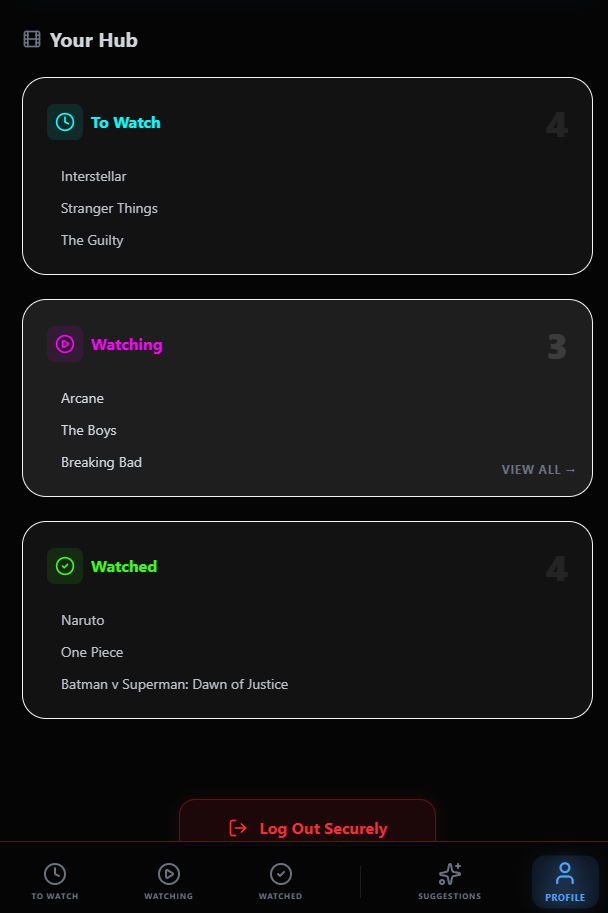
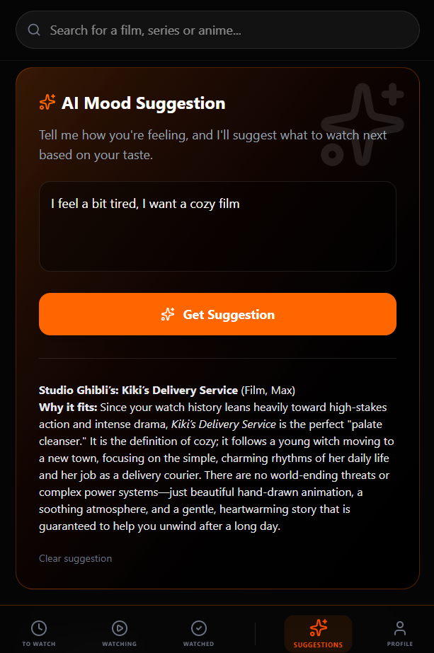
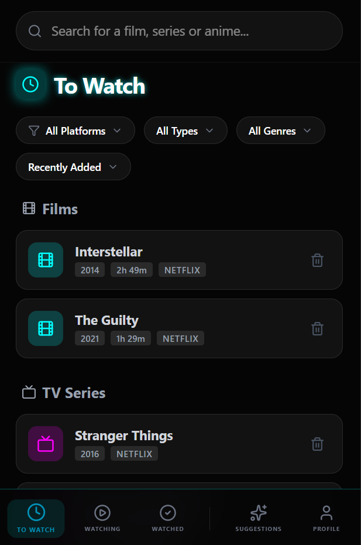
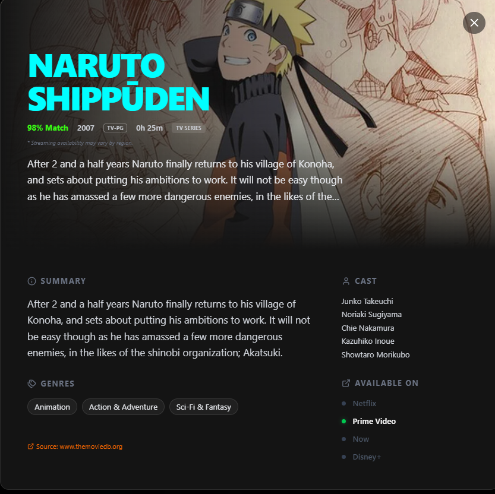
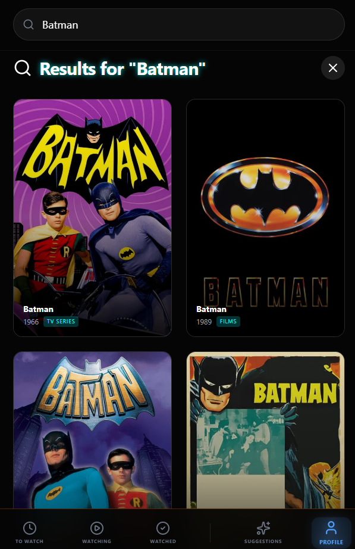
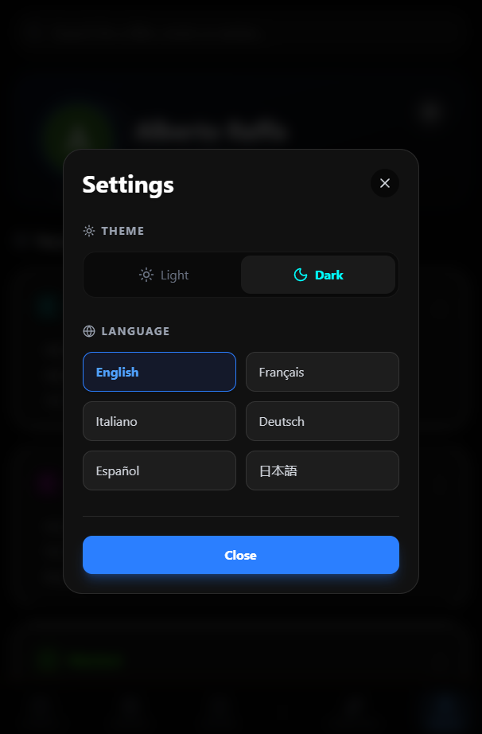

# CineMood 🍿

Welcome to **CineMood**, a smart watchlist application designed to track your favorite movies, TV shows, and anime. 

This project was developed during a 5-day workshop hosted by **Develhope**. Throughout this intensive experience, we embraced the "vibecoding" approach to build a fully functional application by leveraging modern tools like Google AI Studio, Firebase, and the Gemini API.

## 🚀 Core Features

* **Comprehensive Watchlist:** Keep track of your entertainment journey. You can easily categorize movies, TV shows, and anime into three main lists: *Currently Watching*, *Plan to Watch*, and *Already Watched*.
* **AI-Powered Chatbot Recommender:** The heart of CineMood! A built-in chatbot powered by the **Gemini API** acts as your personal movie sommelier. It suggests the perfect title to watch based on your current mood and your previously watched history.

## 📸 App Gallery

<table>
  <tr>
    <td></td>
    <td></td>
  </tr>
  <tr>
    <td></td>
    <td></td>
  </tr>
  <tr>
    <td></td>
    <td></td>
  </tr>
</table>

## 🛠️ Built With

* **Google AI Studio & Gemini API:** For the intelligent chatbot and mood-based recommendations.
* **Firebase:** For robust backend services and data storage.
* **TMDB API:** For fetching accurate media data, including posters, synopses, and details.
* **React & Vite:** For a fast, modern, and responsive user interface.

## 💻 Getting Started

To run this project locally on your machine, follow these steps:

1. Clone the repository:
   `git clone https://github.com/YOUR_USERNAME/cinemood.git`
2. Install the dependencies:
   `npm install`
3. Set up environment variables:
   Duplicate the `.env.example` file, rename it to `.env`, and fill in your own API keys (Firebase, TMDB, and Gemini).
4. Start the development server:
   `npm run dev`

---
*Developed with ❤️ during the Develhope Workshop.*
